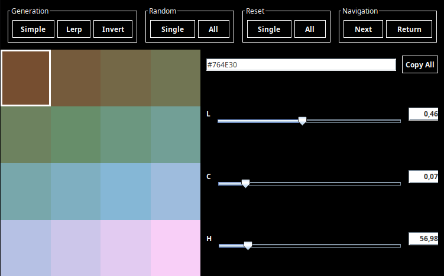

# Color Changer OkLab/OkLch

This project is a **Java application** that provides an interactive GUI for generating and editing color palettes in the **OKLAB color space**, and applying them to images. Users can adjust each color channel (Lightness, Chroma, Hue), generate random or interpolated palettes, invert or reset colors, and preview the changes in real time.

<p align="center">
  
</p>

<p align="center">
  <table align="center">
    <tr>
      <td>
        
      </td>
      <td>
        
      </td>
      <td>
        
      </td>
    </tr>
  </table>
</p>

---

## Table of Contents

1. [Features](#features)
2. [Usage](#usage)
3. [How It Works](#how-it-works)
4. [Color Channels](#color-channels)
5. [Keyboard Shortcuts](#keyboard-shortcuts)
6. [Additional Examples](#additional-examples)

---

## Features

<ul>
  <li><b>Interactive Palette Editing</b>
    <ul>
      <li>Modify individual colors in the palette using sliders or direct hex input.</li>
      <li>Real-time preview of color changes on the palette buttons.</li>
    </ul>
  </li>
  <li><b>Palette Generation</b>
    <ul>
      <li>Generate simple sequential palettes or interpolated palettes between multiple colors.</li>
      <li>Randomize a single color or the entire palette.</li>
      <li>Invert the entire palette to explore complementary color schemes.</li>
    </ul>
  </li>
  <li><b>Color Reset Options</b>
    <ul>
      <li>Reset the current color to its original value or reset all colors in the palette.</li>
    </ul>
  </li>
  <li><b>Clipboard Integration</b>
    <ul>
      <li>Copy a color to clipboard with <code>Ctrl+C</code> and paste it to another color slot with <code>Ctrl+V</code>.</li>
      <li>Copy the entire palette as hex codes using the "Copy All" button.</li>
    </ul>
  </li>
  <li><b>Image Application</b>
    <ul>
      <li>Apply the current palette to an image with a single click and view the result in a new window.</li>
      <li>Preserves image details while mapping colors efficiently to the palette.</li>
    </ul>
  </li>
  <li><b>Keyboard Navigation</b>
    <ul>
      <li>Arrow keys to move the selection across the palette.</li>
      <li>Shortcut keys for randomizing, resetting, and clipboard operations.</li>
    </ul>
  </li>
</ul>

---

## Usage

<ol>
  <li><b>Load an Image</b>
    <ul>
      <li>Open the application:</li>
    </ul>

```bash
java -jar ColorChangerOkLab.jar
```

  <li><b>Select the image file you want to recolor.</b></li>

  </li>

  <li><b>Set Palette Options</b>
    <ul>
      <li>Choose the number of colors for the palette.</li>
      <li>Select whether the color space should be dynamic or fixed.</li>
      <li>The application will create a palette based on these settings.</li>
    </ul>
  </li>

  <li><b>Edit the Palette</b>
    <ul>
      <li>Select a color button on the left panel.</li>
      <li>Adjust the Lightness, Chroma, and Hue sliders on the right panel or input a hex code.</li>
      <li>Use the top buttons to generate, invert, reset, or randomize colors.</li>
    </ul>
  </li>

  <li><b>Apply to Image</b>
    <ul>
      <li>Click <b>Next</b> to apply the palette to the loaded image.</li>
      <li>A new window will open with the processed image.</li>
      <li>The output will be automatically saved with a descriptive filename such as:</li>
    </ul>

```text
Recolored[N_COLORS].png
```

  </li>
</ol>

---

## How It Works

<ol>
  <li><b>Color Storage</b>
    <ul>
      <li>Each color is stored as an <code>OKLAB</code> object containing Lightness, Chroma, and Hue channels.</li>
    </ul>
  </li>

  <li><b>Interactive GUI</b>
    <ul>
      <li>The GUI is built with Swing and MigLayout.</li>
      <li>Palette buttons update in real time as sliders or hex input values change.</li>
      <li>Top button groups provide actions like generating, inverting, randomizing, and resetting colors.</li>
    </ul>
  </li>

  <li><b>Image Mapping</b>
    <ul>
      <li>The <code>PatternToImage</code> module applies the current palette to the loaded image by replacing original colors with the closest palette colors.</li>
      <li>Processing is timed and logged to provide performance feedback.</li>
    </ul>
  </li>

  <li><b>Property Change System</b>
    <ul>
      <li>Palette button selection, slider updates, and hex changes are communicated using <code>PropertyChangeSupport</code> for modular updates.</li>
    </ul>
  </li>
</ol>

---

## Color Channels

<p align="center">
  <table align="center">
    <tr>
      <td><b>Channel</b></td>
      <td><b>Description</b></td>
      <td><b>Range</b></td>
    </tr>
    <tr>
      <td>Lightness (L)</td>
      <td>Perceptual brightness of the color.</td>
      <td>0.0 - 1.0</td>
    </tr>
    <tr>
      <td>Chroma (C)</td>
      <td>Color intensity or saturation.</td>
      <td>0.0 - 0.47</td>
    </tr>
    <tr>
      <td>Hue (H)</td>
      <td>Color angle in degrees around the color wheel.</td>
      <td>0 - 360</td>
    </tr>
  </table>
</p>

---

## Keyboard Shortcuts

<ul>
  <li><b>Ctrl+C</b> → Copy currently selected color</li>
  <li><b>Ctrl+V</b> → Paste copied color to selected slot</li>
  <li><b>Delete</b> → Reset selected color</li>
  <li><b>Ctrl+Delete</b> → Reset all colors</li>
  <li><b>Ctrl+R</b> → Randomize selected color</li>
  <li><b>Arrow Keys</b> → Move selection across palette buttons</li>
</ul>

---

## Additional Examples

<p align="center">
  <table align="center">
    <tr>
      <td><b>Original</b></td>
      <td><b>8 Colors No Interpolation</b></td>
    </tr>
    <tr>
      <td></td>
      <td></td>
    </tr>
    <tr>
      <td><b>Original</b></td>
      <td><b>64 Colors Interpolated</b></td>
    </tr>
    <tr>
      <td></td>
      <td></td>
    </tr>
  </table>
</p>

---
